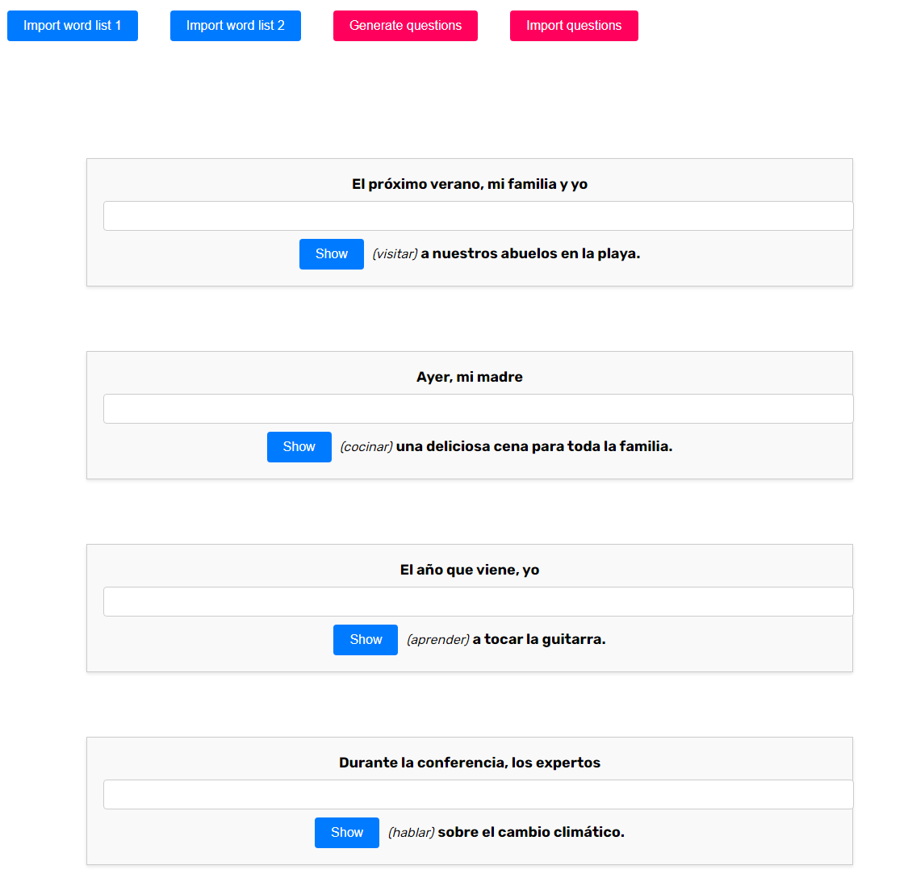

# Overview
This app is a simple "fill-in-the-blank" quiz, where students are asked to conjugate a Spanish verb to fit a sentence.

It is very bare-bones right now. I threw this together for some quick studying. It doesn't keep track of right/wrong answers right now; the "enter your answer" input textbox is just there for convenience.



# Adding custom questions

You can import questions while using the deployed app (no need to modify the code).

To do this, use the `Import questions` button, and paste a JSON array, where each element follows this schema:

```{
    answer: string;
    infinitive: string; // same as correctAnswer but in infinitive
    sentencePartOne: string;
    sentencePartTwo: string;
}
```

(thus, a completed sentence is `sentencePartOne + answer + sentencePartTwo``, separated by spaces.)

# Using ChatGPT, etc. to generate custom questions for you
The following prompt can be used, which should generate JSON that you can import. Be aware that AI bots like ChatGPT sometimes produce incorrect answers - I have encountered this frequently - so be careful.

```
Write a 10 question Spanish quiz where I have to fill in the blank to complete a sentence and the parts that I have to type in is a conjugated verb. you should tell me the infinitive form of the verb. Use only Mexican Spanish not Spain Spanish.

I want you to output the quiz as an array of JSON objects in this format:

{
answer: '',
infinitive: '',
sentencePartOne: '',
sentencePartTwo: ''
}

where sentencePartOne and sentencePartTwo are the parts of the sentence that come before and after the answer, respectively. Ensure that the quiz is unambiguous enough, such that there is only one correct answer per question; to do so, the sentences you form will need to have sufficient context that the answer is not ambiguous.
```


# Installing

1. Ensure you have Node.js and Angular CLI installed.
2. Run `npm install`

# Running

1. Run `npm start`
2. Go to http://localhost:4200/
